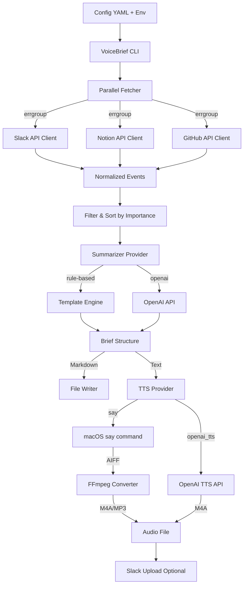

# VoiceBrief 仕様書

| 項目 | 内容 |
| --- | --- |
| **プロジェクト名** | VoiceBrief |
| **バージョン** | v1.0 |
| **コンセプト** | 音声で聞く、チームの最新情報 |
| **実行環境** | macOS (Local) / Go Runtime |

## 1. システム概要

SlackおよびNotionの更新情報をAPI経由で取得し、重要度ベースでフィルタリング・要約した後、macOS標準のTTS（Text-to-Speech）機能を用いて音声ファイル（.aiff/.m4a）を生成するCLIツール。`launchd`による定期実行を前提とし、ユーザーは生成された音声ファイルを聞くだけで直近のチーム状況を把握できる。

**重要な設計方針:**

- 生データ（Slackログ/Notion本文）をディスクに永続保存しない（プライバシー保護）
- 部分失敗を許容し、可能な範囲でブリーフィングを生成（Best Effort）
- 外部API呼び出しは並列化・タイムアウト設定により高速化

## 2. アーキテクチャ構成

### 2.1 システム構成図



### 2.2 技術スタック

**言語・フレームワーク:**

- Go 1.25+
- CLI: cobra/viper または標準flagパッケージ

**外部ライブラリ:**

- `github.com/slack-go/slack` - Slack API Client
- `github.com/jomei/notionapi` - Notion API Client
- `github.com/google/go-github/v57/github` - GitHub API Client（オプション）
- `golang.org/x/sync/errgroup` - 並列処理・エラーハンドリング

**外部システムコマンド:**

- `say` (macOS built-in) - TTS生成
- `ffmpeg` (Optional) - 音声形式変換

**外部API（オプション）:**

- OpenAI API (GPT-4 + TTS) - 高度な要約・音声生成

## 3. 機能要件

### 3.1 実行モード

CLI引数により以下のモードで動作:

| モード | 対象期間 | 目的 |
| --- | --- | --- |
| **Daily** | 過去24時間 | 昨日の作業内容、夜間更新の把握 |
| **Weekly** | 過去7日間 | 週次定例前の全体把握 |

**実行例:**

```bash
voicebrief run --daily
voicebrief run --weekly
```

### 3.2 データ収集（Fetcher）

#### 共通仕様

- 各ソースからの情報を`Event`構造体に正規化
- エラー発生時も他ソースの取得は継続（Best Effort）
- 並列取得（`errgroup`）でパフォーマンス最適化
- 全API呼び出しに`context.WithTimeout`を適用

#### 3.2.1 Slack

**対象:**

- 設定で指定されたChannel ID一覧

**取得期間:**

- Daily: `now - 24h` 〜 `now`
- Weekly: `now - 7d` 〜 `now`

**取得内容:**

- 通常メッセージ（親メッセージ）
- スレッド返信（v1.0では簡易対応、v1.1で強化）

**フィルタリング（設定可能）:**

- Bot投稿の除外
- 短文（例: 10文字未満）の除外
- 特定キーワード（「了解です」「承知」等）の除外
- Join/Leave通知の除外

#### 3.2.2 Notion

**対象:**

- 設定で指定されたDatabase ID一覧

**取得期間:**

- `last_edited_time`が対象期間内のページ

**取得内容（v1.0）:**

- ページタイトル
- `last_edited_time`
- 主要プロパティ（Status/Tag/Project等、設定で指定）
- ページURL

**非対応（v1.0）:**

- ページ本文の全文取得（v1.1+）

#### 3.2.3 GitHub（オプション）

**対象:**

- 自分宛レビュー依頼
- CI失敗通知
- Assigned Issues

**設定:**

- v1.0ではデフォルトOFF（設定でON可能）

### 3.3 イベント正規化・フィルタリング

#### 3.3.1 正規化モデル: `Event`

各ソースから取得したデータを統一モデルに変換:

```go
type Event struct {
    ID          string    // Unique ID
    Source      string    // "slack" | "notion" | "github"
    Category    string    // "dev" | "biz" | "incident" | "ops" | "other"
    Timestamp   time.Time
    Title       string    // 短い見出し
    Body        string    // 本文抜粋（Slack）またはプロパティ要約（Notion）
    URL         string    // Direct Link
    Location    string    // Channel Name or DB Name
    Author      string    // User Name
    Importance  int       // 0〜100（フィルタ・並び替えに利用）
    Refs        map[string]string // 追加情報（channel_id, tags等）
}
```

#### 3.3.2 Importance計算（ルールベース・v1.0）

初期実装では以下の単純ルールで計算:

- 特定キーワード含む（「緊急」「障害」等）: +30
- メンション含む: +20
- スレッド返信が多い（5件以上）: +10
- 短文（10文字未満）: -20
- Bot投稿: -10

v1.1+でML/LLMベースの重要度判定を追加検討。

### 3.4 要約・原稿生成（Summarizer）

#### 3.4.1 Summarizer Provider

設定ファイルで切り替え可能:

| Provider | 説明 | 外部送信 |
| --- | --- | --- |
| `rule` | テンプレートベース（デフォルト） | なし |
| `openai` | GPT-4による要約生成 | あり |

#### 3.4.2 Dailyテンプレート（2〜3分想定）

```markdown
# Daily Briefing - YYYY-MM-DD

## 今日の主な動き（最大3件）
- {Event.Title}: {Event.Body抜粋} ({Event.Location})

## 判断が必要な項目（最大3件）
- {高Importanceイベント}

## リスク・詰まり（最大2件）
- {「障害」「ブロック」等のキーワード含むイベント}

## 参照リンク
- {URL一覧（読み上げは省略可）}
```

#### 3.4.3 Weeklyテンプレート（5〜7分想定）

```markdown
# Weekly Briefing - YYYY-Www

## 今週の流れ
{全体サマリ段落}

## 重要決定
- {Decision系イベント箇条書き}

## 未解決事項
- {Open/Blockedステータスのイベント}

## 来週の注目
- {来週期限のタスク、継続案件}
```

### 3.5 音声合成（TTS）

#### 3.5.1 TTS Provider

| Provider | 説明 | 外部送信 | 音質 |
| --- | --- | --- | --- |
| `say` | macOS標準（デフォルト） | なし | 中 |
| `openai_tts` | OpenAI TTS API | あり | 高 |

#### 3.5.2 音声生成フロー

**sayコマンド使用時:**

1. `say -v {Voice} -o output.aiff "{ScriptText}"`
2. `ffmpeg -i output.aiff -c:a aac -b:a 64k output.m4a`（オプション）

**OpenAI TTS使用時:**

- 直接M4A形式で取得

#### 3.5.3 設定可能パラメータ

- `voice`: Kyoko, Otoya等（sayの場合）
- `rate`: 読み上げ速度（例: 1.1倍速）
- `format`: aiff, m4a, mp3

### 3.6 出力・保存

#### 3.6.1 ローカルファイル保存

```
out/
├── daily/
│   ├── 2025-01-15.md
│   ├── 2025-01-15.m4a
│   └── 2025-01-16.md
├── weekly/
│   ├── 2025-W02.md
│   └── 2025-W02.m4a
└── debug/  # --debug-dumpフラグ時のみ使用
    └── 2025-01-15-raw.json
```

**重要:** `out/debug/`は`.gitignore`対象。生データは`--debug-dump`フラグ指定時のみ保存。

#### 3.6.2 Slack投稿（オプション）

設定で有効化した場合:

- 指定チャンネルまたは自分DMへ投稿
- 投稿内容:
  - タイトル（Daily/Weekly、期間）
  - 要点（箇条書き）
  - 音声ファイル添付（Slack APIで許可されている場合）

### 3.7 CLI仕様

#### 3.7.1 コマンド一覧

```bash
# ブリーフィング生成
voicebrief run --daily
voicebrief run --weekly

# 設定確認
voicebrief config check

# 接続テスト・権限確認
voicebrief doctor

# バージョン情報
voicebrief version
```

#### 3.7.2 共通オプション

```bash
--config PATH        # 設定ファイルパス（デフォルト: ./config.yaml）
--out-dir PATH       # 出力ディレクトリ（デフォルト: ./out）
--dry-run            # 音声化・投稿せず、原稿生成まで
--debug-dump         # 生データをout/debug/に保存（注意: プライバシー）
--log-level LEVEL    # ログレベル: debug|info|warn|error
```

## 4. データモデル詳細

### 4.1 設定ファイル（config.yaml）

```yaml
# config.yaml (config.example.yamlとして配布)
app:
  output_dir: "./out"
  log_level: "info"

slack:
  token_env: "VOICE_BRIEF_SLACK_TOKEN"  # 環境変数名
  channels:
    - id: "C01234567"
      name: "general"
    - id: "C09876543"
      name: "dev-backend"
  filters:
    exclude_bots: true
    exclude_short_messages: true
    min_length: 10
    exclude_keywords:
      - "了解です"
      - "承知しました"
  post_channel: "C_PERSONAL"  # 出力先（オプション）

notion:
  token_env: "VOICE_BRIEF_NOTION_TOKEN"
  databases:
    - id: "db-uuid-xxxx"
      name: "Design Docs"
      properties: ["Status", "Tag", "Project"]
    - id: "db-uuid-yyyy"
      name: "Task Board"
      properties: ["Status", "Assignee"]

github:  # オプション
  enabled: false
  token_env: "VOICE_BRIEF_GITHUB_TOKEN"
  username: "your-username"

brief:
  daily_window_hours: 24
  weekly_days: 7
  max_items_daily: 8
  max_items_weekly: 25

summarizer:
  provider: "rule"  # "rule" | "openai"
  # openai_model: "gpt-4"  # providerがopenaiの場合

tts:
  provider: "say"  # "say" | "openai_tts"
  voice: "Kyoko"   # say使用時
  rate: 1.1        # 読み上げ速度
  format: "m4a"    # aiff, m4a, mp3

runtime:
  max_concurrency: 5
  api_timeout_seconds: 30
```

### 4.2 環境変数（.env）

```bash
VOICE_BRIEF_SLACK_TOKEN="xoxb-..."
VOICE_BRIEF_NOTION_TOKEN="secret_..."
VOICE_BRIEF_GITHUB_TOKEN="ghp_..."  # オプション
VOICE_BRIEF_OPENAI_API_KEY="sk-..."  # openai providerを使う場合
```

**重要:** `.env`ファイルは`.gitignore`対象。`.env.example`を配布。

### 4.3 内部データ構造

```go
// Event - 正規化イベントモデル
type Event struct {
    ID          string
    Source      string    // "slack" | "notion" | "github"
    Category    string    // "dev" | "biz" | "incident" | "ops" | "other"
    Timestamp   time.Time
    Title       string
    Body        string
    URL         string
    Location    string    // Channel/DB name
    Author      string
    Importance  int       // 0-100
    Refs        map[string]string
}

// Brief - ブリーフィング出力モデル
type Brief struct {
    Type          string    // "daily" | "weekly"
    WindowStart   time.Time
    WindowEnd     time.Time
    ScriptText    string    // TTS用プレーンテキスト
    ScriptMarkdown string   // 保存用Markdown
    AudioPath     string    // 生成音声ファイルパス
    Items         []Event   // 採用されたイベント一覧
}

// Section - 原稿セクション
type Section struct {
    Title string   // "今日の主な動き"
    Items []string // 読み上げテキスト
}
```

## 5. ディレクトリ構成（Standard Go Project Layout）

```
voice-brief/
├── cmd/
│   └── voicebrief/
│       └── main.go              # Entry point
├── internal/
│   ├── config/                  # 設定ファイル読み込み
│   │   ├── config.go
│   │   └── config_test.go
│   ├── model/                   # データモデル定義
│   │   ├── event.go
│   │   └── brief.go
│   ├── fetcher/                 # API Clients
│   │   ├── fetcher.go           # Parallel fetcher
│   │   ├── slack.go
│   │   ├── notion.go
│   │   └── github.go
│   ├── filter/                  # イベントフィルタリング
│   │   └── importance.go
│   ├── summarizer/              # 要約・原稿生成
│   │   ├── summarizer.go        # Interface
│   │   ├── rule.go              # Rule-based
│   │   └── openai.go            # LLM-based (オプション)
│   ├── tts/                     # 音声合成
│   │   ├── tts.go               # Interface
│   │   ├── say.go               # macOS say
│   │   └── openai_tts.go        # OpenAI TTS (オプション)
│   └── uploader/                # Slack投稿
│       └── slack.go
├── scripts/
│   ├── install.sh               # launchd plist設置スクリプト
│   └── com.voicebrief.daily.plist  # launchd設定例
├── out/                         # 出力先（.gitignore）
├── .env.example
├── config.example.yaml
├── go.mod
├── go.sum
├── README.md
└── Spec.md                      # 本ファイル
```

## 6. 非機能要件

### 6.1 プライバシー・データ保持

| 項目 | 方針 |
| --- | --- |
| 生データ保存 | **デフォルトで保存しない** |
| ディスク保存対象 | 生成物（原稿・音声）、実行ログのみ |
| デバッグモード | `--debug-dump`フラグ指定時のみ`out/debug/`へ保存 |
| `.gitignore` | `out/`, `.env`を必ず含める |

### 6.2 安定性

- 全API呼び出しに`context.WithTimeout`適用（デフォルト30秒）
- 部分失敗許容（例: Notion失敗でもSlackだけでブリーフィング生成）
- 構造化ログによる障害追跡（JSON形式）

### 6.3 パフォーマンス

- 複数チャンネル・DBの並列取得（`errgroup`）
- API Rate Limit制御（`max_concurrency`設定）
- タイムアウト設定によるハング防止

### 6.4 セキュリティ

| 項目 | 対策 |
| --- | --- |
| トークン管理 | 環境変数で管理、設定ファイルに直接記載しない |
| 最小権限 | 各API接続に必要最小限のScopeのみ付与 |
| 外部送信 | OpenAI利用時は明示的な設定フラグが必要 |

## 7. API権限要件

### 7.1 Slack Bot Scopes

```
channels:history       # Public channel履歴読み取り
groups:history         # Private channel履歴読み取り（必要なら）
chat:write             # 投稿機能（オプション）
files:write            # 音声ファイル添付（オプション）
```

### 7.2 Notion Integration

- 対象DatabaseへのRead権限
- （v1.1+でタスク登録する場合はWrite権限追加）

### 7.3 GitHub（オプション）

- `repo`スコープ または
- `notifications`スコープ（Review request取得に必要）

## 8. テスト戦略

### 8.1 ユニットテスト

- 各パッケージに`*_test.go`を配置
- カバレッジ目標: 70%以上（コア機能）

### 8.2 統合テスト

- `--dry-run`モードでE2Eテスト
- Mock APIレスポンスによるフェッチャーテスト

### 8.3 受け入れ条件（Definition of Done）

- [ ] `voicebrief run --daily`が失敗なく完走
- [ ] `out/daily/`にMDと音声が生成される
- [ ] `voicebrief run --weekly`同様
- [ ] デフォルトで生データが保存されない
- [ ] `.env.example`/`config.example.yaml`/READMEで第三者が実行可能
- [ ] `voicebrief doctor`で接続確認ができる
- [ ] launchdで定期実行できる（サンプルplist提供）

## 9. 今後の拡張（Roadmap）

詳細は`Roadmap.md`を参照。

| バージョン | 主な機能 |
| --- | --- |
| **v1.0** | Daily/Weekly実行、Rule-based要約、macOS say |
| **v1.1** | Slackスレッド対応、Notionプロパティフィルタ強化、ML重要度判定 |
| **v1.2** | OpenAI要約・TTS統合、iPhoneショートカット連携 |
| **v2.0** | マルチプラットフォーム対応（Linux/Windows）、Web UI |

## 10. 制約事項・前提条件

### 10.1 動作環境

- macOS 12.0以降（`say`コマンド利用のため）
- ffmpegインストール推奨（音声形式変換）
- Go 1.21以降

### 10.2 制限事項

- v1.0ではNotionページ本文は取得しない（タイトル・プロパティのみ）
- Slackスレッド取得は簡易実装（全返信ではなく親メッセージ中心）
- GitHub連携は初期バージョンではオプション扱い

## 11. 用語集

| 用語 | 説明 |
| --- | --- |
| Brief | ブリーフィング。生成された原稿と音声のセット |
| Event | 正規化されたSlack/Notion/GitHubイベント |
| Importance | イベントの重要度（0〜100）、フィルタ・並び替えに使用 |
| Provider | SummarizerやTTSの実装方式（rule/openai等） |
| launchd | macOSの定期実行デーモン |

---

## 12. 参考資料

- [Slack API Documentation](https://api.slack.com/docs)
- [Notion API Reference](https://developers.notion.com/reference/intro)
- [macOS say command man page](https://ss64.com/osx/say.html)
- [Standard Go Project Layout](https://github.com/golang-standards/project-layout)

---

**更新履歴:**

- 2025-01-XX: v1.0仕様策定（本ドキュメント）
